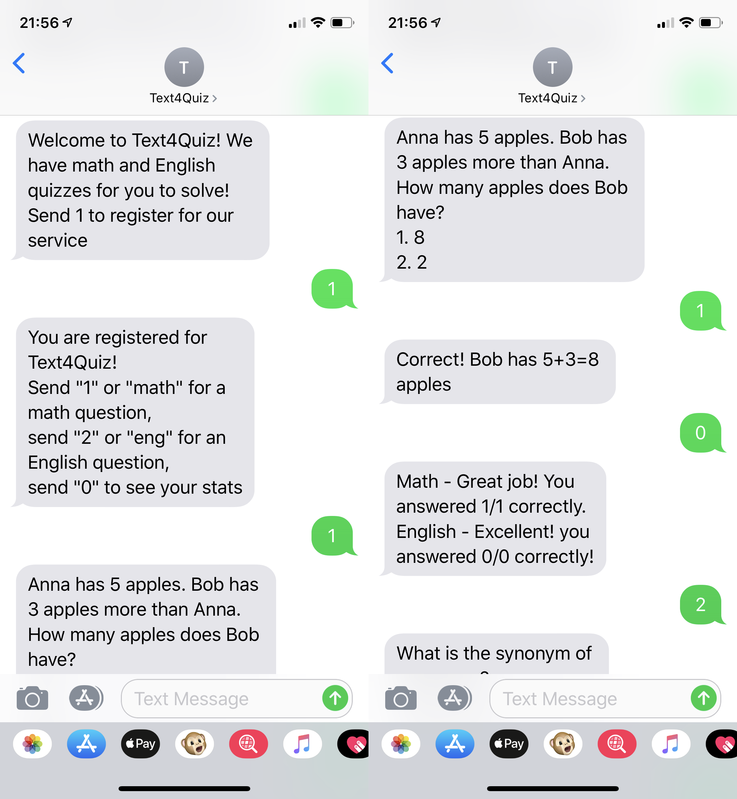

# Text4Quiz: SMS Quiz Application 
Text4Quiz is a project for ICTD class (Autumn 2018) at the Paul G. Allen School.

## About ##

This repository contains the prototype of an interactive SMS quiz application called Text4Quiz. It is designed for children in underserved areas where there is a limited access to secondary eduation. Some examples of the barriers to education are the limited educational resource, the distance to school, and the expense of education. State of Education in Africa Report 2015 stated that secondary schools in Africa can accommodate only 36% of qualifying secondary students. 

## Installation ##
This application is written using Node.js with MongoDB database. To run the application, Twilio number and a public URL is required. For development, I used [ngrok](https://ngrok.com) to expose a port in my localhost server.

1. Setup Twilio and ngrok
2. Create and edit the configuration file `.env`
3. Start the app by running `npm start`

## Screenshot ##

